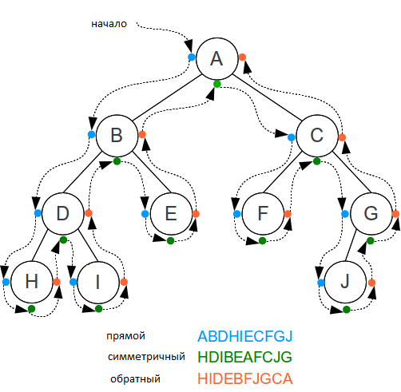

## Обход деревьев разных типов
- Прямой обход идет в следующем порядке: корень, левый потомок, правый потомок. 
- Симметричный — левый потомок, корень, правый потомок. 
- Обратный – левый потомок, правый потомок, корень.

